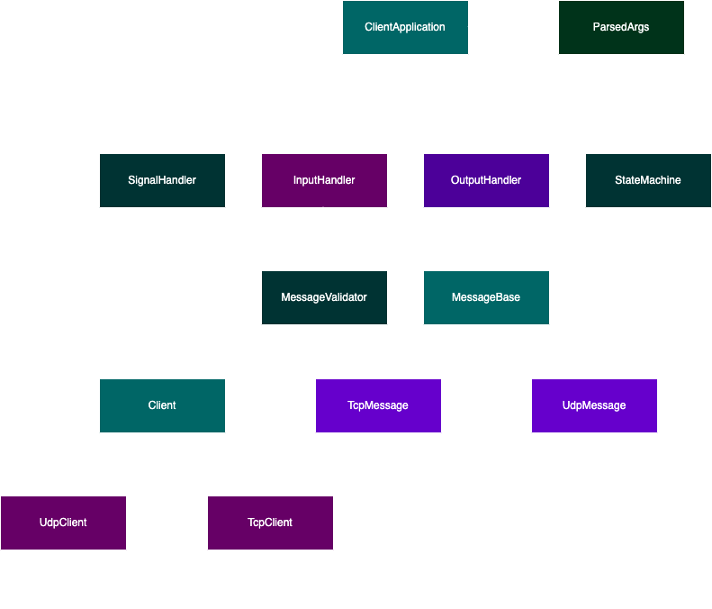
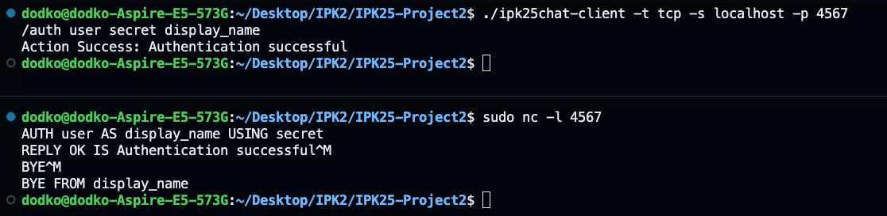
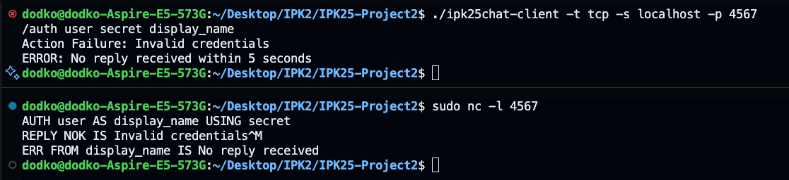
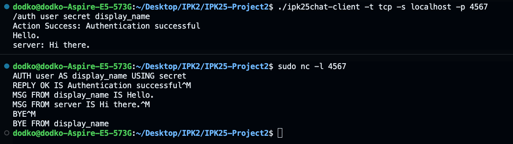
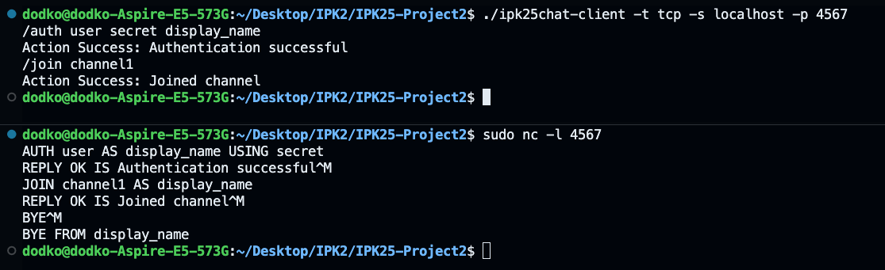
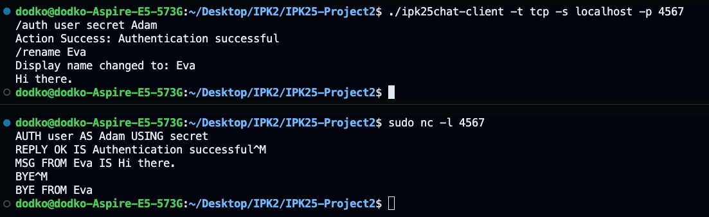
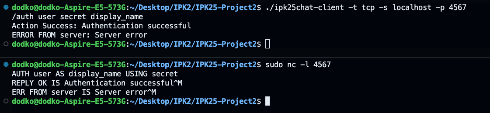
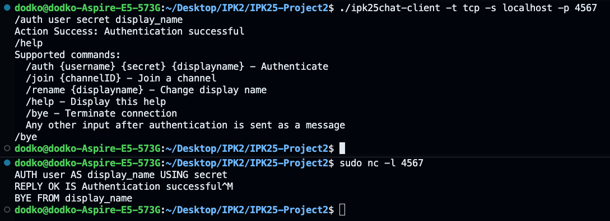
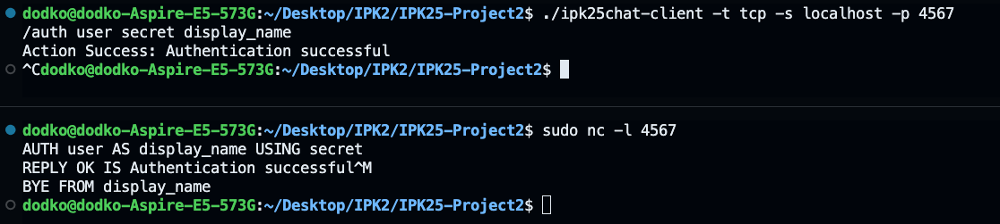

# IPK25-CHAT Client Documentation

This document provides an overview, theoretical background, implementation details, testing procedures, and additional information for the `IPK25-CHAT` client project, developed as part of the IPK course at FIT VUT. The client is a command-line application that communicates with a chat server using the IPK25-CHAT protocol over TCP or UDP, adhering to the project specification.

## Table of Contents
1. [Project Overview](#project-overview)
2. [Usage](#usage)
3. [Theoretical Background](#theoretical-background)
   1. [Protocol Messages](#protocol-messages)
   2. [Finite State Machine](#finite-state-machine)
   3. [Network Considerations](#network-considerations)
4. [Implementation Details](#implementation-details)
   1. [Directory Structure](#directory-structure)
   2. [Key Components](#key-components)
   3. [Design Decisions](#design-decisions)
   4. [Platform Dependencies](#platform-dependencies)
5. [UML Diagram](#uml-diagram)
6. [Testing](#testing)
   1. [Test Environment](#test-environment)
   2. [Test Cases](#test-cases)
   3. [Notes on Replication](#notes-on-replication)
7. [Extra Functionality](#extra-functionality)
8. [Known Limitations](#known-limitations)
9. [Bibliography](#bibliography)

## Project Overview

The IPK25-CHAT client is a C++20 application that connects to a chat server, authenticates users, joins channels, and exchanges messages using the IPK25-CHAT protocol. It supports both TCP (text-based) and UDP (binary and text-based) communication, with robust handling of network issues like packet loss and duplicates. The client follows a Mealy finite state machine (FSM) to manage protocol states and provides a user-friendly command-line interface (CLI) for interaction.

## Usage

The client is invoked with the following syntax:

```
./ipk25chat-client -t {tcp|udp} -s <server> [-p <port>] [-d <timeout>] [-r <retries>] [-h]
```
#### Required Arguments:

`-t {tcp|udp}`: Specifies the transport protocol (tcp for TCP, udp for UDP).

`-s <server>`: Server IP address (IPv4) or hostname.

#### Optional Arguments:

`-p <port>`: Server port (default: 4567).

`-d <timeout>`: UDP confirmation timeout in milliseconds (default: 250).

`-r <retries>`: Maximum number of UDP retransmissions (default: 3).

`-h`: Displays help information about command-line arguments and exits.

Example
```
./ipk25chat-client -t tcp -s 192.168.1.100 -p 4567
./ipk25chat-client -t udp -s chat.example.com -d 500 -r 5
```

Key features:
- Supports TCP and UDP transport protocols.
- Implements all required message types: `AUTH`, `JOIN`, `MSG`, `ERR`, `BYE`, `REPLY`, `CONFIRM`, `PING`.
- Handles user input via commands (`/auth`, `/join`, `/rename`, `/help`, `/bye`) and messages.
- Ensures graceful termination on `Ctrl+C` or `Ctrl+D`.
- Validates message parameters and handles errors robustly.

The project is implemented in C++20, using object-oriented programming principles, and is designed to run on Linux (Ubuntu 24.04 LTS, `amd64`), leveraging POSIX sockets for network communication.

## Theoretical Background

The IPK25-CHAT protocol is a simple, application-layer protocol for real-time chat communication. It operates over IPv4 and uses a client-server model. The protocol defines two transport variants:

- **TCP Variant**: Text-based messages, terminated by `\r\n`, following an ABNF grammar. Messages are reliable due to TCP's guarantees, so no additional confirmation mechanism is needed.
- **UDP Variant**: Primarily binary messages (e.g., `AUTH`, `REPLY`) with a header (`Type`, `MessageID`) and null-terminated fields. Text-based messages are used for `MSG`, `ERR`, `JOIN`, and `BYE`. UDP requires a confirmation mechanism (`CONFIRM`) to handle packet loss, with timeouts and retries.

### Protocol Messages
The protocol supports the following message types:
- **AUTH**: Authenticates a user with `Username`, `DisplayName`, and `Secret`.
- **JOIN**: Joins a channel specified by `ChannelID`.
- **MSG**: Sends a message to the current channel.
- **ERR**: Indicates an error with a descriptive message.
- **BYE**: Terminates the connection.
- **REPLY**: Responds to `AUTH` or `JOIN` with success (`OK`) or failure (`NOK`).
- **CONFIRM** (UDP only): Confirms receipt of a message.
- **PING** (UDP only): Server heartbeat, requiring a `CONFIRM` response.

### Finite State Machine
The client operates as a Mealy FSM with five states:
- **START**: Initial state; accepts `AUTH` or `BYE`.
- **AUTH**: Awaits `REPLY` after sending `AUTH`, transitions to `OPEN` on success, stays in `AUTH` on failure.
- **OPEN**: Main state for sending/receiving `MSG`, `JOIN`, or `BYE`.
- **JOIN**: Awaits `REPLY` after sending `JOIN`, transitions to `OPEN` on success.
- **END**: Terminal state, no further messages are processed.

Transitions are triggered by client or server messages, with `ERR` or `BYE` leading to `END`. The FSM ensures protocol compliance and proper state management.

### Network Considerations
- **TCP**: Reliable, connection-oriented; requires graceful shutdown to avoid `RST`.
- **UDP**: Unreliable, requires handling of packet loss (via retries), duplicates (via `MessageID`), and dynamic server ports.

## Implementation Details

The client is implemented in C++20, using object-oriented programming to achieve modularity and maintainability. The codebase is organized into logical components, each responsible for a specific aspect of functionality.

### Directory Structure

The project source files are organized in the `src` directory with a modular structure, separating concerns into logical subdirectories. Below is the directory tree:

```bash
src/
├── client_application.cpp  # Main application logic coordinating components
├── client_application.hpp  # Header for ClientApplication class
├── common/                 # Shared utilities
│   ├── args.cpp           # Command-line argument parsing
│   ├── args.hpp           # Header for argument parsing
│   ├── debug.hpp          # Debug logging macros
│   ├── message_validator.cpp  # Message parameter validation
│   └── message_validator.hpp  # Header for message validation
├── io/                    # Input/output handling
│   ├── input_handler.cpp  # Processes user input from stdin
│   ├── input_handler.hpp  # Header for InputHandler class
│   ├── output_handler.cpp # Formats and prints output to stdout
│   └── output_handler.hpp # Header for OutputHandler class
├── main.cpp               # Program entry point
├── messages/              # Message parsing and formatting
│   ├── message_base.hpp   # Abstract base class for messages
│   ├── tcp_message.cpp    # TCP message handling
│   ├── tcp_message.hpp    # Header for TcpMessage class
│   ├── udp_message.cpp    # UDP message handling
│   └── udp_message.hpp    # Header for UdpMessage class
├── network/               # Network communication
│   ├── client.hpp         # Abstract Client interface
│   ├── tcp_client.cpp     # TCP client implementation
│   ├── tcp_client.hpp     # Header for TcpClient class
│   ├── udp_client.cpp     # UDP client implementation
│   └── udp_client.hpp     # Header for UdpClient class
├── signal_handler.cpp     # Signal handling (SIGINT, EOF)
├── signal_handler.hpp     # Header for SignalHandler class
└── state/                 # Finite state machine
    ├── state_machine.cpp  # Mealy FSM implementation
    └── state_machine.hpp  # Header for StateMachine class
```

### Key Components
1. **ClientApplication**:
   - Coordinates the main loop, integrating `Client`, `StateMachine`, `InputHandler`, `OutputHandler`, and `SignalHandler`.
   - Uses `poll()` to monitor `stdin` and the server socket asynchronously.
   - Manages timeouts for `AUTH`/`JOIN` requests (5 seconds).

2. **Client (TcpClient/UdpClient)**:
   - Abstract `Client` interface provides `send_message`, `receive_message`, `terminate`, and `get_socket_fd`.
   - `TcpClient`: Manages TCP connections with RAII socket cleanup and graceful shutdown.
   - `UdpClient`: Handles UDP communication, including `MessageID` tracking, confirmation timeouts (default 250ms), retries (default 3), and duplicate detection.

3. **MessageBase (TcpMessage/UdpMessage)**:
   - Abstract `MessageBase` defines message type, content, and success status.
   - `TcpMessage`: Parses/formats text-based messages with `\r\n` termination.
   - `UdpMessage`: Handles binary (e.g., `AUTH`) and text (e.g., `MSG`) formats, with `MessageID` for UDP reliability.

4. **StateMachine**:
   - Implements the Mealy FSM, transitioning based on client/server messages.
   - Ensures protocol compliance by validating state transitions.

5. **InputHandler**:
   - Processes `stdin` input, supporting commands (`/auth`, `/join`, `/rename`, `/help`, `/bye`) and messages.
   - Validates input using `MessageValidator`.

6. **OutputHandler**:
   - Formats output for `MSG`, `ERR`, `REPLY` messages and local errors, adhering to the specification.

7. **MessageValidator**:
   - Validates message parameters (e.g., `Username`, `DisplayName`) using regex and ASCII checks.

8. **SignalHandler**:
   - Handles `SIGINT` (Ctrl+C) and EOF (Ctrl+D), sending `BYE` and terminating gracefully.

### Design Decisions
- **RAII for Sockets**: The `Socket` class in `TcpClient` ensures sockets are closed automatically, preventing resource leaks.
- **Polymorphism**: `Client` and `MessageBase` use virtual functions to support TCP/UDP seamlessly.
- **Debug Logging**: A `printf_debug` macro logs to `stderr` when `DEBUG=1`, aiding development and testing.
- **Modular Structure**: Components are separated into directories (`common`, `io`, `messages`, `network`, `state`) for clarity.
- **Exception Handling**: Errors (e.g., invalid messages, network failures) are caught and displayed to the user, ensuring robustness.

### Platform Dependencies
The client uses POSIX sockets (`<sys/socket.h>`, `<arpa/inet.h>`) and is designed for Linux (Ubuntu 24.04 LTS). It has been tested on the reference VM provided by FIT VUT.

## UML Diagram

 

## Testing

The client was tested extensively to ensure compliance with the IPK25-CHAT protocol and robustness under various conditions. Tests were conducted on the reference VM (Ubuntu 24.04 LTS, `amd64`) using a simulated server via `netcat`. The test suite focuses on TCP functionality, covering authentication, message exchange, channel joining, and error handling. Due to time constraints, UDP was not tested properly. The only UDP tests were conducted during development using Wireshark.

### Test Environment
- **OS**: Ubuntu 24.04 LTS (`amd64`)
- **Compiler**: g++ (GCC 13.2.0, C++20 standard)
- **Tools**:
  - `netcat` (for simulating the server)
  - `tcpdump` (for capturing and analyzing network traffic, optional)
  - `Wireshark` (with provided IPK25-CHAT dissector for protocol analysis)
- **Program**: `ipk25chat-client`, built with `make`

### Test Cases
- **Preparation**: Start the server `sudo nc -l 4567` and client `./ipk25chat-client -t tcp -s localhost -p 4567` on port 4567.

#### Test Case 1: TCP - Successful Authentication
- **Purpose**: Verify authentication with valid credentials.
- **Client**: 
```
/auth user secret display_name
```

- **Server**:

```AUTH user AS display_name USING secret
REPLY OK IS Authentication successful
```
- **Expected Output**:
```
Action Success: Authentication successful
```
- **Test Result**: Successful login.




#### Test Case 2: TCP - Invalid Authentication
- **Purpose**: Verify system handles invalid credentials.
- **Client**: 
```
/auth user secret display_name
```
- **Server**:

```
AUTH user AS display_name USING secret
REPLY NOK IS Invalid credentials
ERR FROM display_name IS No reply received
```
- **Expected Output**:
```
Action Failure: Invalid credentials
```
- **Test Result**: Failure as expected.




#### Test Case 3: TCP - Simple Message Exchange
- **Purpose**: Test chat message after authentication.
- **Client**: 
```
/auth user secret display_name
Hello.
```
- **Server**:

```
AUTH user AS display_name USING secret 
REPLY OK IS Authentication successful 
MSG FROM display_name IS Hello. 
MSG FROM server IS Hi there.
```
- **Expected Output**:
```
Action Success: Authentication successful 
server: Hi there.
```
- **Test Result**: Successful message exchange.




#### Test Case 4: TCP - Join Channel
- **Purpose**: Join a channel after authentication.
- **Client**: 
```
/auth user secret display_name 
/join channel1
```
- **Server**:

```
AUTH user AS display_name USING secret 
REPLY OK IS Authentication successful 
JOIN channel1 AS display_name 
REPLY OK IS Joined channel
```
- **Expected Output**:
```
Action Success: Joined channel
```
- **Test Result**: Successfully joined.




#### Test Case 5: TCP - Rename Display Name
- **Purpose**: Change display name after authentication.
- **Client**: 
```
/auth user secret Adam 
/rename Eva 
Hi there.
```
- **Server**:

```
AUTH user AS Adam USING secret 
REPLY OK IS Authentication successful 
MSG FROM Eva IS Hi there.
```
- **Expected Output**:
```
Display name changed to: Eva
```
- **Test Result**: Rename successful.




#### Test Case 6: TCP - Server Error After Authentication
- **Purpose**: Simulate server-side error after auth.
- **Client**: 
```
/auth user secret display_name
```
- **Server**:

```
AUTH user AS display_name USING secret 
REPLY OK IS Authentication successful 
ERR FROM server IS Server error
```
- **Expected Output**:
```
ERROR FROM server: Server error
```
- **Test Result**: Server error correctly displayed.




#### Test Case 7: TCP - Help Command
- **Purpose**: Display help text.
- **Client**: 
```
/auth user secret display_name 
/help 
/bye
```
- **Server**:

```
AUTH user AS display_name USING secret 
REPLY OK IS Authentication successful 
BYE FROM display_name
```
- **Expected Output**:
```
Supported commands: ...
```
- **Test Result**: Help message printed.




#### Test Case 8: TCP - Client Interrupt
- **Purpose**: Simulate client closing connection.
- **Client**: 
```
/auth user secret display_name 
(Ctrl+C)
```
- **Server**:

```
AUTH user AS display_name USING secret 
REPLY OK IS Authentication successful 
BYE FROM display_name
```
- **Expected Output**:
```
(no explicit output, connection terminated)
```
- **Test Result**: Handled clean disconnect.




### Notes on Replication
- **Server**: Use `netcat` (`nc -l <port>`) or a custom script simulating the IPK25-CHAT protocol. Ensure messages end with `\r\n`.
- **Output Verification**:
  - On the server, monitor received messages manually or with `tcpdump` (`sudo tcpdump -i lo port 4567`).
  - On the client, check stdout in the terminal or redirect output to a file (`./ipk25chat-client ... > output.txt`).
- **Debugging**: If a test fails, use debug logs (`DEBUG=1 make && ./ipk25chat-client ...`) for details.

## Extra Functionality

- **`/bye` Command**: The `/bye` command allows the user to gracefully terminate the connection with the server by sending a `BYE` message. The connection is then closed without triggering a `RST` flag (in the case of TCP).


## Known Limitations
- **Limited UDP Testing**: More time is needed to properly develop and test UDP part of this assignment.
- **Limited Error Handling**: The client could be improved to handle more specific error cases.

## Bibliography

1. **FIT VUT. IPK25-CHAT Protocol Specification.**  
   Brno: Faculty of Information Technology, VUT, 2025.  
   Official specification of the IPK25-CHAT protocol, defining message formats, states, and TCP/UDP variants.

2. **Stevens, W. R., Fenner, B., & Rudoff, A. M.**  
   *Unix Network Programming, Volume 1: The Sockets Networking API.* 3rd ed. Addison-Wesley, 2004.  
   Comprehensive guide to POSIX sockets programming, used for implementing TCP and UDP communication.

3. **ISO/IEC. ISO/IEC 14882:2020 – Programming languages – C++.** 2020.  
   Standard for C++20, referenced for modern C++ features like smart pointers and regex.

4. **IEEE. IEEE Std 1003.1-2017 (POSIX).** The Open Group, 2017.  
   POSIX standard for system calls (socket, poll, signal), used for network and signal handling.

5. **CppReference. C++ Reference.** [Online]. Available: https://en.cppreference.com/w/. [Accessed: April 20, 2025].  
   Online documentation for C++ standard library, used for implementing classes and containers.

6. **Linux Man Pages. socket(2), poll(2), signal(2).** [Online]. Available: https://man7.org/linux/man-pages/. [Accessed: April 20, 2025].  
   Manual pages for POSIX system calls, referenced for socket programming and signal handling.

7. **Wireshark. Wireshark User’s Guide.** [Online]. Available: https://www.wireshark.org/docs/wsug_html_chunked/. [Accessed: April 20, 2025].  
   Guide for network traffic analysis, used for debugging and validating protocol messages.

8. **ChatGPT.** *AI-based Chatbot for Theoretical Explanations.* OpenAI, 2025.  
Used as a source for theoretical explanations and clarifications on various technical topics related to networking, programming, and system design.