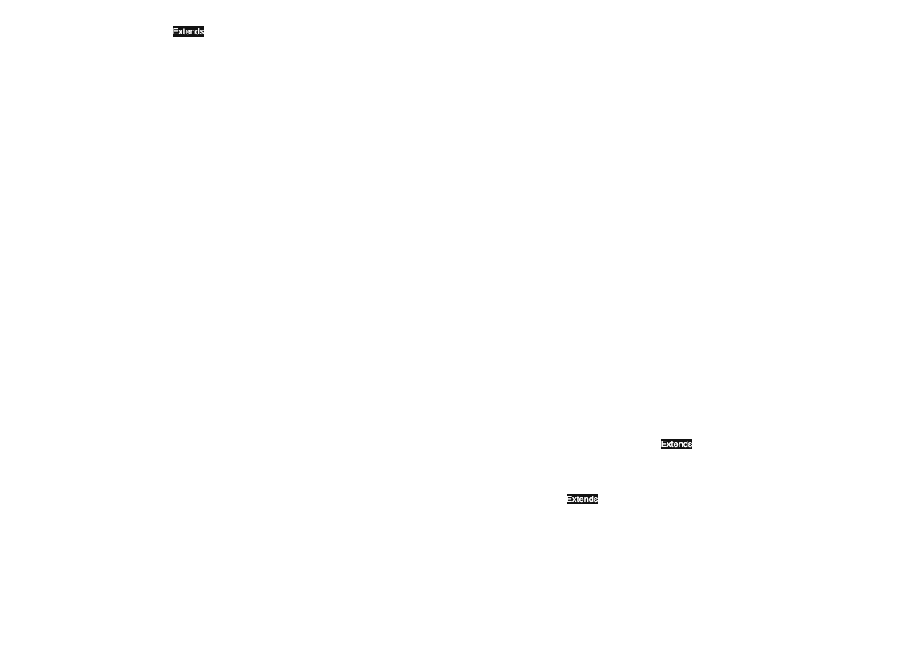

# Implementation Documentation for Task 2 of IPP 2024/2025
**Name and Surname:** Jozef Ondrejička  
**Login:** xondre16  

## Overview
The `interpret.php` script implements an interpreter for the SOL25 language, an object-oriented language with message-passing semantics inspired by Smalltalk. The interpreter processes XML input defining a program, parses its structure, and executes it by handling class definitions, method calls, and dynamic message dispatching. The implementation is organized into a modular, object-oriented structure with clear separation of concerns, ensuring extensibility, maintainability, and robustness. It adheres to PHP’s object-oriented principles, leveraging inheritance, interfaces, and exception handling to manage complexity and errors effectively.

## Functional Decomposition
The interpreter is divided into several key components, each encapsulated in a dedicated class or group of classes. This modular design isolates responsibilities, such as parsing, execution, and message handling, making the codebase easier to maintain and extend.

### 1. Program Parsing and Structure
- **`Program`**:
  - **Purpose**: Represents the entire SOL25 program, serving as the entry point for parsing and storing class definitions.
  - **Implementation**: Parses XML input using PHP’s `DOMDocument` and `DOMXPath` for robust XML traversal. It extracts class definitions into an associative array (`$classes`), indexed by class names. The parser enforces the presence of a `Main` class, throwing an `InterpretTypeException` (exit code 52) if absent or malformed.

- **`SolClass`**:
  - **Purpose**: Models a SOL25 class, encapsulating its name, optional parent class, methods, and attributes.
  - **Implementation**: Parses class definitions from XML nodes, storing methods in an array (`$methods`) and attributes in another (`$attributes`). Supports inheritance through a reference to a parent class and implements `isSubclassOf` for type checking. Creates instances as `ObjectValue` objects, initializing attributes as needed.

- **`Method`**:
  - **Purpose**: Represents a method within a class, comprising a selector (message name) and an executable code block.
  - **Implementation**: Parses method XML nodes to extract the selector and associated `Block`. Executes the method’s body by evaluating the block in a given `Context`, passing the receiver (`self`) and arguments.

### 2. Execution Context
- **`Context`**:
  - **Purpose**: Manages the runtime environment, acting as a central hub for class registry, message handlers, variable scopes, and singleton objects.
  - **Implementation**: Initializes built-in classes (`Object`, `Integer`, `String`, `Block`) with predefined methods and message handlers for operations like `print`, `+`, `ifTrue:ifFalse:`, and `whileTrue:`. Maintains a stack of `Frame` objects for variable scoping, supporting sub-contexts for block execution via `createSubContext`. Provides access to singletons (`nil`, `true`, `false`) and manages frame operations with `pushFrame` and `popFrame`.

- **`Frame`**:
  - **Purpose**: Represents a variable scope, storing local variables and the `self` object for method or block execution.
  - **Implementation**: Stores variables in an associative array (`$variables`), with special handling for `self` and `super`. Resolves `super` dynamically by traversing the class hierarchy to locate the parent class’s method.

### 3. Expression Evaluation
- **`Expression`**:
  - **Purpose**: Abstract base class for all expressions, defining the `evaluate` method for computing values.
  - **Implementation**: Provides a common interface for concrete expression types, ensuring consistent evaluation semantics. Subclasses include:
    - **`Literal`**: Evaluates to constant values (integers, strings, or singletons like `Nil`, `True`, `False`).
    - **`Variable`**: Retrieves values from the current `Frame`, throwing `InterpretValueException` for undefined variables.
    - **`Send`**: Evaluates message sends by computing the receiver and arguments, then dispatching the message via `MessageDispatcher`.
    - **`BlockExpr`**: Creates a `BlockValue` encapsulating a `Block` and its defining `Context`, enabling closures.

- **`Assign`**:
  - **Purpose**: Manages variable assignments, storing evaluated expression results in the current `Frame`.
  - **Implementation**: Parses assignment XML nodes, evaluates the associated `Expression`, and updates the `Frame`. Special handling for `print` messages assigns the receiver’s value while triggering output as a side effect.

### 4. Message Dispatching
- **`MessageDispatcher`**:
  - **Purpose**: Central component for resolving and executing messages, implementing SOL25’s dynamic dispatch mechanism.
  - **Implementation**: Resolves messages in the following order:
    1. Checks registered `MessageHandlerInterface` implementations for built-in operations (e.g., `print`, `+`).
    2. Searches the receiver’s class hierarchy for a matching `Method`, using a cache (`$methodCache`) to avoid repeated lookups.
    3. Resolves attribute access for getter/setter-like messages (e.g., `x` or `x:`).
    4. Handles native values for `Integer` and `String` subclasses, ensuring seamless integration with built-in operations.
    Throws `InterpretDNUException` (exit code 54) for unrecognized messages (“does not understand”).

- **`MessageHandlerInterface` and Handlers**:
  - **Purpose**: Defines a contract for handling built-in messages, with concrete implementations for specific operations.
  - **Implementation**: Key handlers include:
    - `PrintHandler`: Outputs values to stdout (`print`).
    - `PlusHandler`, `MinusHandler`, `MultiplyByHandler`, `DivByHandler`: Perform arithmetic operations on `IntegerValue`.
    - `IfTrueIfFalseHandler`, `AndHandler`, `OrHandler`, `NotHandler`: Implement conditional and logical operations for `BoolValue`.
    - `ValueHandler`, `WhileTrueHandler`, `TimesRepeatHandler`: Execute `BlockValue` instances for control flow.
    - `AsStringHandler`, `AsIntegerHandler`, `ConcatenateWithHandler`: Handle type conversions and string manipulations.
  - **Extensibility**: The interface allows easy addition of new handlers for custom messages or future language extensions.

### 5. Value Representation
- **`SolValue`**:
  - **Purpose**: Abstract base class for all values in SOL25, providing a unified interface for message sending and type querying.
  - **Implementation**: Defines `sendMessage` for dispatching messages and `getClass` for accessing the associated `SolClass`. Subclasses include:
    - **`ObjectValue`**: Represents objects with attributes (stored in an array) and supports message dispatching via `MessageDispatcher`.
    - **`IntegerValue`, `StringValue`, `BoolValue`, `NilValue`**: Encapsulate primitive values with native PHP representations, overriding `sendMessage` for built-in operations.
    - **`BlockValue`**: Encapsulates a `Block` and its defining `Context`, enabling closures with preserved variable scopes.

### 6. Main Interpreter
- **`Interpreter`**:
  - **Purpose**: Orchestrates the entire interpretation process, serving as the top-level controller.
  - **Implementation**: Extends `AbstractInterpreter` to:
    1. Load and parse XML input using `Program`.
    2. Initialize the `Program` and `Context` with built-in classes and handlers.
    3. Verify the existence of the `Main` class and its `run` method.
    4. Execute the `run` method on a `Main` instance, passing control to the program.
    Manages a `MessageDispatcher` instance for all message sends. Uses `STDIN` and `STDOUT` for input/output operations, ensuring compatibility with the SOL25 specification.
  - **Error Handling**: Catches and handles exceptions systematically:
    - `XMLException` (exit code 31): Invalid XML input.
    - `InterpretTypeException` (exit code 52): Type errors, such as missing `Main` class.
    - `InterpretDNUException` (exit code 54): Unrecognized messages.
    - `InterpretValueException` (exit code 53): Invalid values or operations.
    Returns appropriate exit codes as per the IPP 2024/2025 requirements.
  - **Performance**: Optimizes startup by deferring initialization of non-essential components until needed.

## UML Diagram
Below is a simplified UML class diagram illustrating key components and their relationships:

